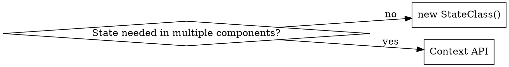

# Svelte 5 Client-Side State

**Classes with `$state` are the idiomatic way to manage client-side state in Svelte 5.**

Replaces the old `writable`/`readable` store pattern. More performant, better TypeScript support, cleaner encapsulation.

**For rune syntax (`$state`, `$derived`) see [runes.md](runes.md).**

## Quick Reference

**Sharing:** Local only? Instantiate directly. Shared across components? Use context.



**Class structure:** Interface → Class with `$state` fields → Factory/context export

**File extension:** `.svelte.ts` required for `$state` outside components

**Key rules:**
- Arrow function methods (avoid `this` binding issues)
- `Symbol()` for context keys (avoid collisions)
- Never export module-level instances (SSR leak in SvelteKit)

## The Pattern

```typescript
// CounterState.svelte.ts

// 1. Define interface (public contract)
interface CounterState {
	count: number;
	increment: () => void;
}

// 2. Implement with $state fields + arrow methods
class CounterStateClass implements CounterState {
	count = $state(0);
	increment = () => { this.count++; };
}

// 3. Export factory or context helpers
export const createCounterState = () => new CounterStateClass();
```

```svelte
<!-- Usage: direct instantiation -->
<script>
	import { createCounterState } from './CounterState.svelte';
	const state = createCounterState();
</script>
<button onclick={state.increment}>{state.count}</button>
```

## Shared State (Context API)

```typescript
// CounterState.svelte.ts
import { getContext, setContext, hasContext } from 'svelte';

const KEY = Symbol('counter');
export const setCounterState = () => setContext(KEY, new CounterStateClass());
export const getCounterState = () => {
	if (!hasContext(KEY)) throw new Error('Counter context not set');
	return getContext<CounterState>(KEY);
};
```

```svelte
<!-- Parent component: set context -->
<script>
	import { setCounterState } from './CounterState.svelte';
	setCounterState();
</script>

<!-- Any descendant: consume -->
<script>
	import { getCounterState } from './CounterState.svelte';
	const state = getCounterState();
</script>
```

## Reference Files

- [references/class-state/class-patterns.md](references/class-state/class-patterns.md) —
  Interface-first design, arrays, timers, async
- [references/class-state/context-vs-scoped.md](references/class-state/context-vs-scoped.md) —
  When to share state vs isolate
- [references/class-state/common-mistakes.md](references/class-state/common-mistakes.md) —
  Anti-patterns with fixes
- [references/class-state/ssr-safety.md](references/class-state/ssr-safety.md) —
  **SvelteKit only:** avoiding state leaks with SSR

## Notes

- Use `Symbol()` for context keys to avoid collisions
- Arrow function methods avoid `this` binding issues
- Context flows down: set in parent, access in descendants
- **SvelteKit users:** Never export module-level state (SSR leak) — see ssr-safety.md
